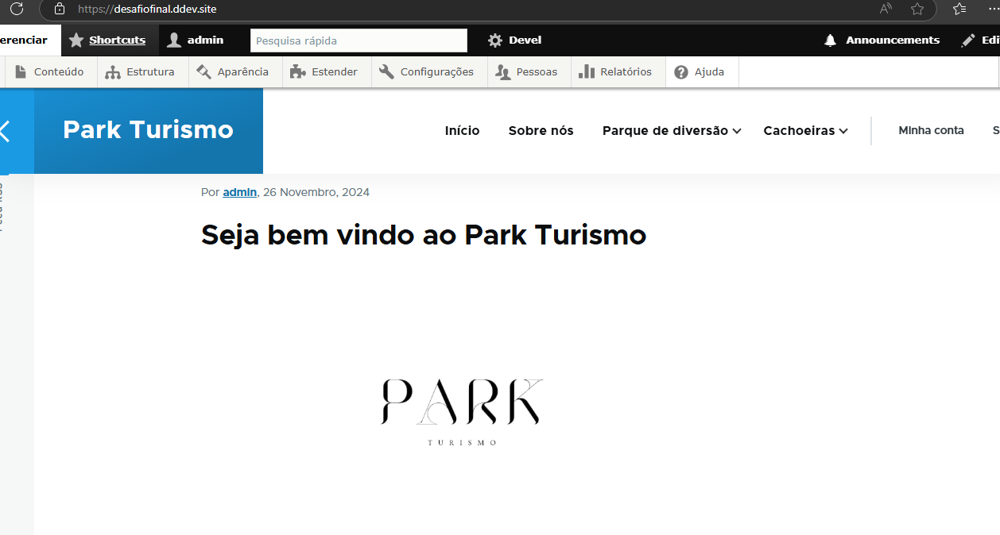

# Projeto Drupal 11 - **/Desafiofinal**

## Descrição
Um site sobre turismo, onde o nome dele é Park Turismo sobre cachoeira e parque de diversão

## Pré-requisitos
* **Servidor web:** Apache, Nginx ou outro compatível com PHP
* **PHP:** Versão recomendada pelo Drupal 11
* **Banco de dados:** MySQL, PostgreSQL ou outro suportado pelo Drupal 11
* **Composer:** Gerenciador de dependências do PHP

## Instalação
1. **Clone o repositório:**
   ```bash
   git clone https://github.com/maila520/bootcamp-trabalho-final-Maila.git
   ```

2. **Instale as dependências:**
   ``` bash
   cd bootcamp-trabalho-final-Maila
   ```
   
   ``` bash
   composer install
   ```

3. **Para abrir o drupal no navegador:**
   ``` bash
   drupal launch
   ```


Depois de executar o **drupal launche** ira abrir essa pagina no seu navegador:




